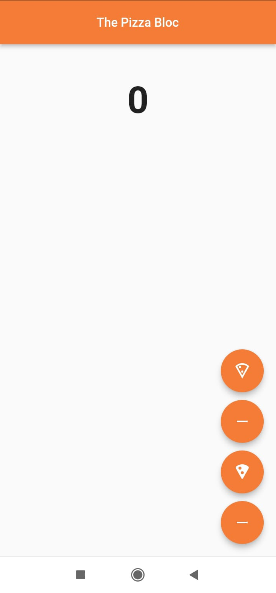
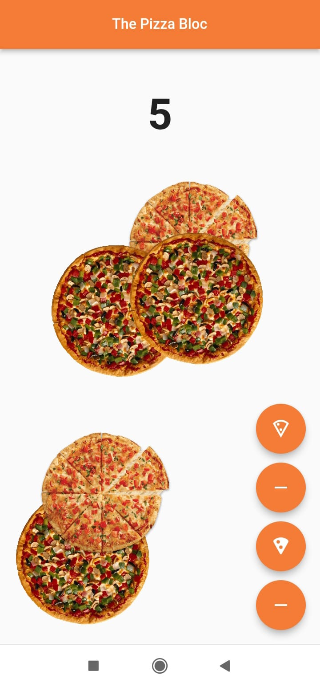
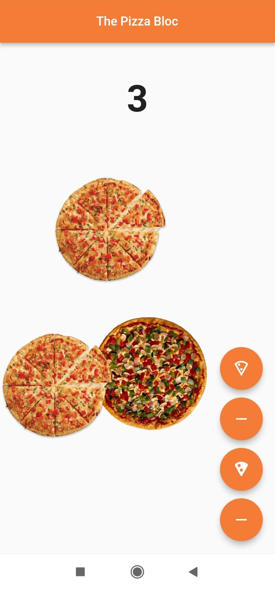

# Pizza Bloc App

A Flutter application that utilizes the `flutter_bloc` package to manage state. This app allows users to view and manage a collection of two types of pizzas by adding or removing their images. The images are displayed on the screen, and the state is managed using the BLoC pattern.

## Features

- **View Pizza Images**: Displays images of two different kinds of pizzas.
- **Add Pizza Images**: Add images of the selected pizzas to the screen.
- **Remove Pizza Images**: Remove images of the selected pizzas from the screen.
- **State Management**: Uses the `flutter_bloc` package to manage the state of the pizza images.

## Screenshots

<p align="center">
  
  
  
</p>

## Getting Started

### Prerequisites

- Flutter SDK: [Install Flutter](https://flutter.dev/docs/get-started/install)
- Dart SDK (included with Flutter)

### Installation

1. Clone the repository:
    ```sh
    git clone https://github.com/aparnaprabhuu/Pizza-Bloc-App.git
    ```
2. Navigate to the project directory:
    ```sh
    cd Pizza-Bloc-App
    ```
3. Install dependencies:
    ```sh
    flutter pub get
    ```

### Running the App

1. Ensure a device is connected or an emulator is running.
2. Run the app:
    ```sh
    flutter run
    ```
